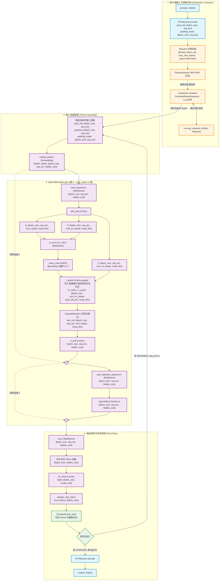

# StepInfer 系统架构与全链路数据流转图

```mermaid
flowchart TD
    %% 样式定义
    classDef clientStyle fill:#e1f5fe,stroke:#0288d1,stroke-width:2px;
    classDef schedStyle fill:#fff3e0,stroke:#f57c00,stroke-width:2px;
    classDef modelStyle fill:#f3e5f5,stroke:#7b1fa2,stroke-width:2px;
    classDef loopStyle fill:#e8f5e9,stroke:#388e3c,stroke-width:2px;

    %% 1. 客户端接入与调度中枢
    subgraph SchedSub ["1. 客户端接入与调度中枢 (Scheduler & Queues)"]
        direction TB
        Prompts["prompts: list[str]"]:::clientStyle
        Tokenizer["HFTokenizer.encode<br/>input_ids: [batch_size, seq_len]<br/>padding_mask: [batch_size, seq_len]"]:::clientStyle
        ReqPack["Request 实例封装<br/>(prompt_token_ids, max_new_tokens, status=WAITING)"]:::schedStyle
        
        WaitQueue["RequestQueue (WAITING 队列)"]:::schedStyle
        RunningDict["running_requests: dict[str, Request]"]:::schedStyle
        
        Scheduler["Scheduler.schedule<br/>ScheduleResult(requests, is_prefill)"]:::schedStyle

        Prompts --> Tokenizer --> ReqPack --> WaitQueue
        WaitQueue -->|"提取待处理请求"| Scheduler
        Scheduler <-->|"维护活跃请求"| RunningDict
    end

    %% 2. 模型输入准备
    subgraph PrepSub ["2. 输入张量装配 (Tensor Assembly)"]
        direction TB
        Assembly["组装当前步输入张量<br/>input_ids: [batch_size, seq_len]<br/>positions: [batch_size, seq_len]<br/>padding_mask: [batch_size, seq_len]"]:::modelStyle
        Embed["embed_tokens (Embedding)<br/>hidden_states: [batch_size, seq_len, hidden_size]"]:::modelStyle
        Assembly --> Embed
    end

    Scheduler -->|"组织当前步 Batch"| Assembly

    %% 3. Transformer 解码层核心计算
    subgraph LayerLoop ["3. Qwen3DecoderLayer (第 0 .. num_layers-1 层)"]
        direction TB
        Embed --> PreNorm["input_layernorm (RMSNorm)<br/>[batch_size, seq_len, hidden_size]"]:::modelStyle
        Embed -.->|"残差连接 1"| Add1(("+")):::modelStyle

        PreNorm --> QKVProj["qkv_proj (Linear)"]:::modelStyle
        
        QKVProj --> QNode["Q: [batch_size, seq_len, num_heads, head_dim]"]:::modelStyle
        QKVProj --> KNode["K: [batch_size, seq_len, num_kv_heads, head_dim]"]:::modelStyle
        QKVProj --> VNode["V: [batch_size, seq_len, num_kv_heads, head_dim]"]:::modelStyle

        QNode --> QKNorm["q_norm & k_norm (RMSNorm)"]:::modelStyle
        KNode --> QKNorm

        QKNorm --> RoPE["rotary_emb (RoPE)<br/>按 positions 旋转 Q, K"]:::modelStyle

        RoPE --> CacheUpdate["LayerKVCache.update<br/>写入新键值并返回有效历史切片<br/>K_cache, V_cache: [batch_size, num_kv_heads, total_seq_len, head_dim]"]:::modelStyle
        VNode --> CacheUpdate

        CacheUpdate --> CausalAttn["CausalAttention (点积注意力)<br/>attn_out: [batch_size, seq_len, num_heads, head_dim]"]:::modelStyle

        CausalAttn --> OProj["o_proj (Linear)<br/>[batch_size, seq_len, hidden_size]"]:::modelStyle
        OProj --> Add1

        Add1 --> PostNorm["post_attention_layernorm (RMSNorm)<br/>[batch_size, seq_len, hidden_size]"]:::modelStyle
        Add1 -.->|"残差连接 2"| Add2(("+")):::modelStyle

        PostNorm --> MLP["Qwen3MLP (SwiGLU)<br/>[batch_size, seq_len, hidden_size]"]:::modelStyle
        MLP --> Add2
    end

    %% 4. 输出投影与自回归闭环
    subgraph OutSub ["4. 输出预测与状态收敛 (Post-Step)"]
        direction TB
        FinalNorm["norm (RMSNorm)<br/>[batch_size, seq_len, hidden_size]"]:::modelStyle
        SliceToken["切片末位 Token 向量<br/>[batch_size, hidden_size]"]:::modelStyle
        LMHead["lm_head (Linear)<br/>logits: [batch_size, vocab_size]"]:::modelStyle
        Sampler["sample_next_token<br/>next_tokens: [batch_size]"]:::modelStyle

        Add2 --> FinalNorm --> SliceToken --> LMHead --> Sampler

        PostStep["Scheduler.post_step<br/>写回 Token 并更新状态"]:::loopStyle
        Sampler --> PostStep

        StatusCheck{"是否完成?"}:::loopStyle
        PostStep --> StatusCheck

        StatusCheck -->|"否 (RUNNING: seq_len=1)"| Assembly
        StatusCheck -->|"是 (FINISHED: 移出批次)"| Detok["HFTokenizer.decode"]:::clientStyle
        Detok --> Outputs["outputs: list[str]"]:::clientStyle
    end
```
